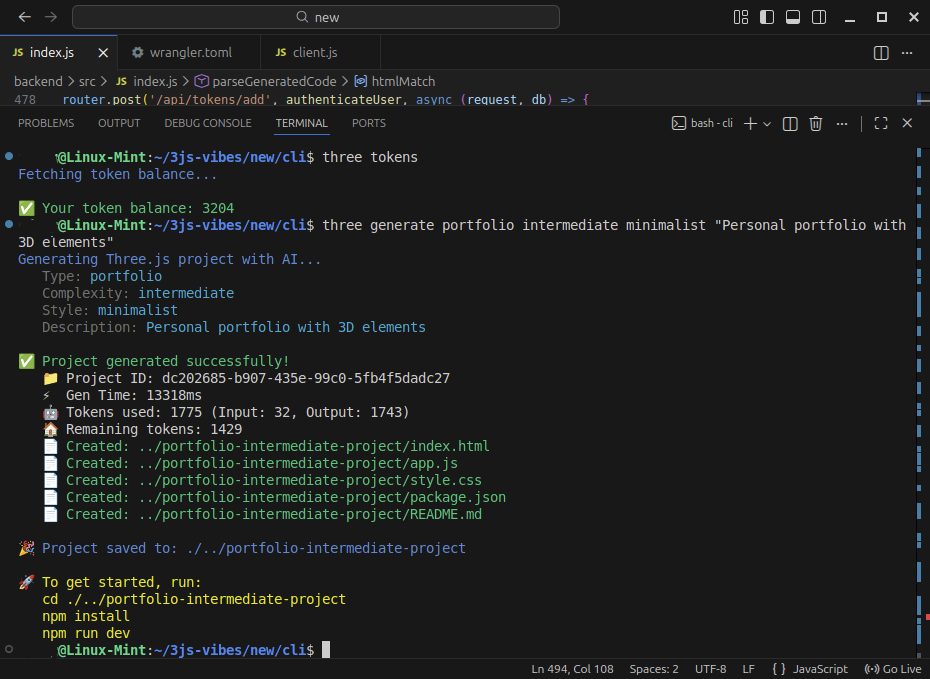

# Three.js AI CLI Generator

## unreleased

A powerful command-line interface to generate full Three.js projects using an AI. Describe your project in plain English and get a ready-to-use, professional-grade Three.js boilerplate.



## Features

- **AI-Powered Generation**: Leverages a powerful AI backend to generate Three.js code from natural language descriptions.
- **Project Scaffolding**: Creates all necessary files, including `index.html`, `app.js`, `style.css`, `package.json`, and a `README.md`.
- **User & Token Management**: Simple registration, login, and token management system to track your usage.
- **Secure Backend Communication**: Interacts with a secure, token-authenticated backend service.
- **In-CLI Payments**: Provides a mechanism to purchase more tokens directly from the command line.

## Installation

Install the CLI globally using npm:

```bash
npm install -g threejs-ai-cli
```

## Prerequisites

This CLI is a client for the Three.js AI backend service. You must have the backend service deployed and running for the CLI to function.

## Configuration

The CLI stores your user credentials (including your User ID and API Key) in a local configuration file. This file is located at: `~/.config/threejs-ai-cli/config.json`.

The CLI manages this file automatically upon registration and login.

## Usage

The CLI can be invoked using either `three` or `threejs-ai`.

```
three <command> [options]
```

### Core Commands

**`register`**
Register a new user account.

- **Usage**: `three register --email <your-email> --username <your-username>`
- **Example**: `three register --email user@example.com --username testuser`

---

**`login`**
Log in and save your credentials locally. The API key is provided on registration.

- **Usage**: `three login --username <your-username> --key <your-api-key>`
- **Example**: `three login --username testuser --key tk_...`

---

**`generate`**
Generate a new Three.js project based on a description.

- **Usage**: `three generate [type] [complexity] [style] [description]`
- **Arguments**:
    - `type`: (Optional) The type of project. E.g., `portfolio`, `game`, `product-showcase`. Defaults to `portfolio`.
    - `complexity`: (Optional) The project's complexity. E.g., `basic`, `intermediate`, `advanced`. Defaults to `intermediate`.
    - `style`: (Optional) The visual style. E.g., `minimalist`, `realistic`, `cartoon`. Defaults to `minimalist`.
    - `description`: (Optional) A detailed description of your project.
- **Example**: `three generate game advanced realistic "A 3D space shooter with asteroids and particle effects"`

---

### Account & Billing Commands

**`tokens`**
Check your current token balance.

- **Usage**: `three tokens`

---

**`buy`**
Purchase additional tokens via PayPal. This command generates a payment link.

- **Usage**: `three buy <amount> [package-type]` or `three buy <package-name>`
- **Examples**:
    - `three buy 10 standard`
    - `three buy premium`

---

**`package`**
View available token packages and their pricing. This command will attempt to open the pricing page in your browser.

- **Usage**: `three package`

---

### Utility Commands

**`whoami`**
Displays the currently logged-in user's and API KEY information.

- **Usage**: `three whoami`

---

**`create-key`**
Creates an additional new API KEY associated with your account.

- **Usage**: `three create-key [key-name]`
- **Example**: `three create-key "My Test Key"`

---

**`help`**
Show the help message.

- **Usage**: `three help`

## License

ISC
